# OSCP_Preparation

Makine IP: 10.129.1.1 

 Nmap'i -A parametresi ile birlikte çalıştırıyorum. 

 -A parametresi NMAP’te en sık kullanılan parametrelerin bazılarını otamatik olarak kullanılmış olur.
Bunlar ise İşletim Sistemi Tespiti, Versiyon Tespiti, Script taraması ve Traceroute’tur. 

```console
Nmap -A 10.129.1.1  
```
 
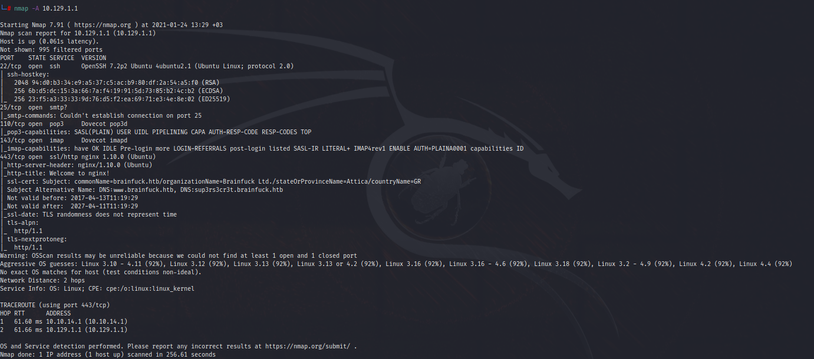

OpenSSH versiyonu üzerinden exploitdb'ye sorgu gönderiyorum ve bilinen bir zafiyet var mı kontrol ediyorum.

```console
searchsploit OpenSSH 7.2p2
```
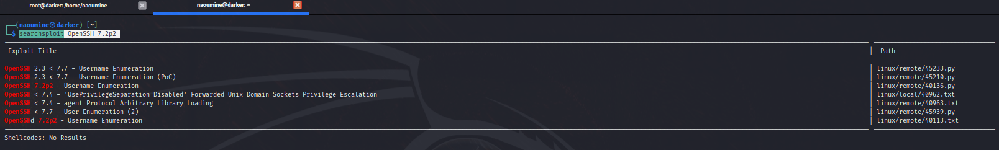


https://www.exploit-db.com/exploits/40136 Username Enumeration açıklığı olduğu gözükmektedir.

Msfconsole DB içerisinde var mı kontrol etmem gerekiyor.

```console
msf6 > search OpenSSH 
```

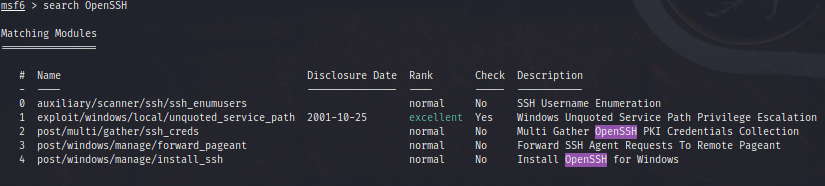

auxiliary olarak var. Keşif için iyi bir başlangıç olabilir.

Elimde username passwprd olmadığı için bu yöntemde başarılı olamadım. Brute-Force denemeye karar verdim ve sonuç yine iç açıcı değildi. Neden ssh açığını bu kadar zorlamak zorundasın başka yerlere bak derken kendime...

```console
nikto -h https://10.129.1.1 
```

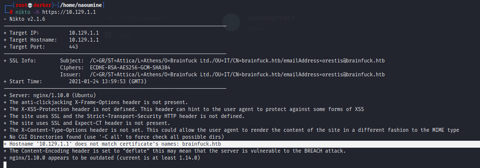

Hemen giidp sitenin sertifikasını inceleyelim.

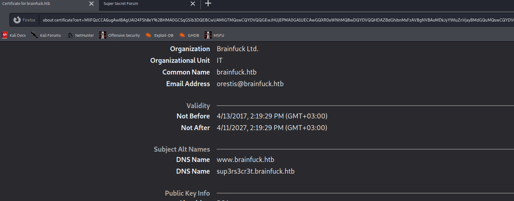

Neredeydi bu host dosyası ! Düzenle..

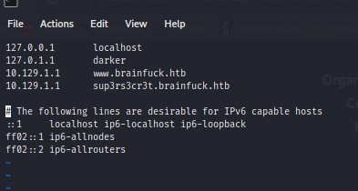

Bence hazırız. Burada yağtığımız siteye giden isteği aslında kendi IP Adresimize yönlendirerek url de ne var buna bakmak.

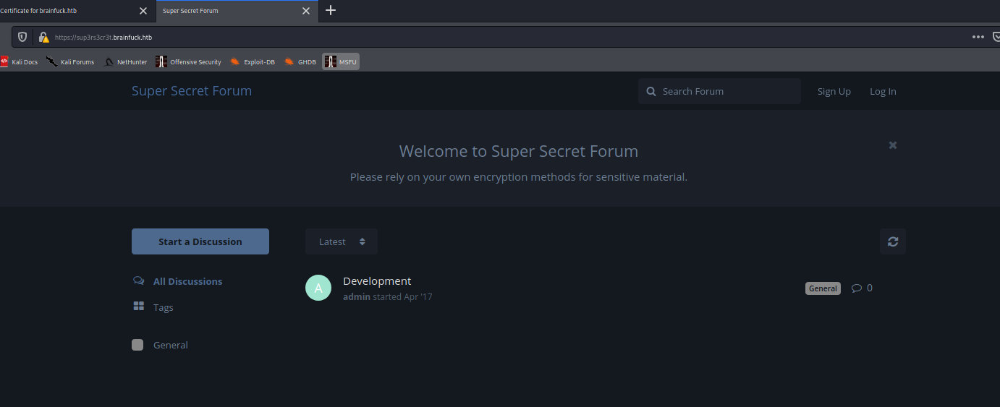

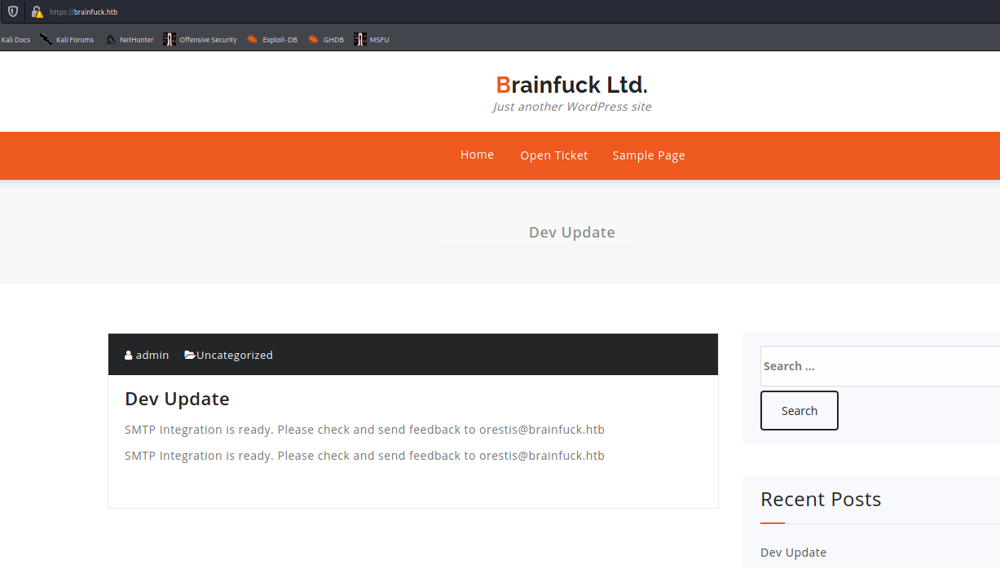


https://brainfuck.htb Wordpress kullanarak tasarlanmış. Bu yüzden wpscan kullanmaya karar verdim.

Wpscan, ruby programlama dili kullanılarak geliştirilmiş WordPress güvenlik tarama yazılımıdır. Wordpress kullanan sistemlere yönelik kullanıcı adı belirleme, parola bulma ve güvenlik yamalarının kontrolü gibi basit kontroller gerçekleştirir.

```console
wpscan --url https://brainfuck.htb --disable-tls-checks --api-token ***                 
```

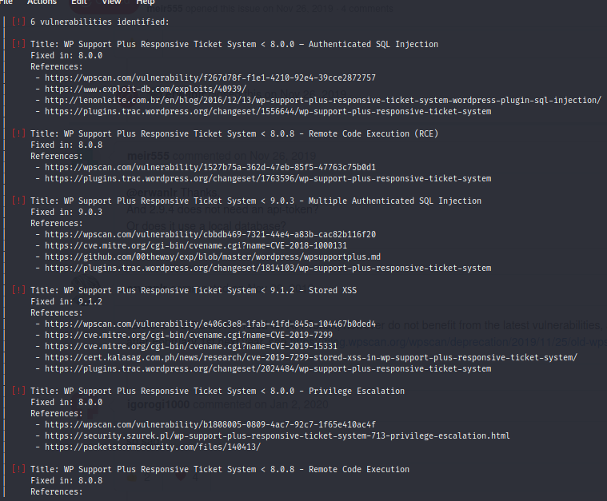
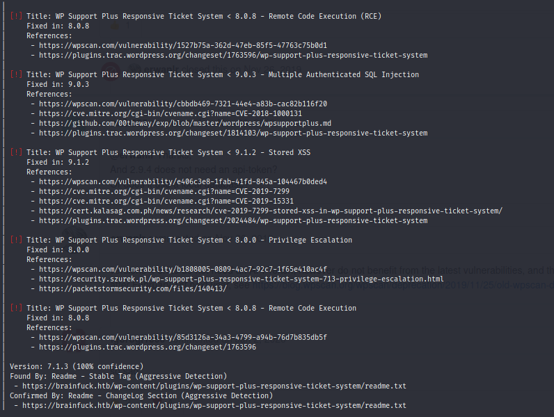

```console
searchsploit WP Support Plus Responsive Ticket System 7.1.3  
```

https://www.exploit-db.com/exploits/41006 exploitini bulduk. Username bilgisine ihtiyacımız var.

User bilgilerini almayı deneyelim.

```console
wpscan --url https://brainfuck.htb --disable-tls-checks --api-token dqu89ZnGCNj7YJ3bGGivE0ozfsQAa7Hm27tocr9Itvo --enumerate u     
```
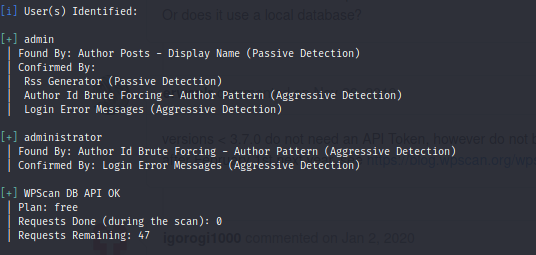

admin ve administrator kullanıldığı gözükmektedir.

İlgili payloadı exploit db sitesinden indirdim ve aşağıdaki gibi düzenledim.

```console
pico 41006.html  
```

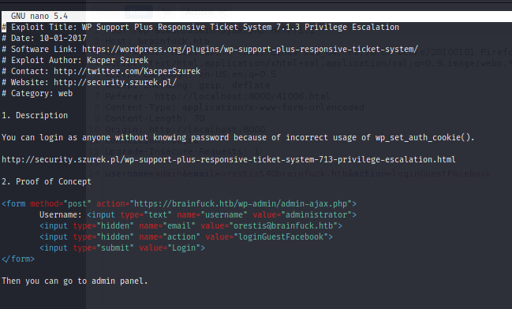

Local Host'u ayağa kaldırıyoruz.

```console
python -m SimpleHTTPServer 
```
Ve html olarak kaydettiğimiz exploitimize browserdan gidip istek yapıyoruz. Burp ile araya girmeyi unutmuyoruz. Burada amacımız admin bilgisi ile giriş yapabilmek.

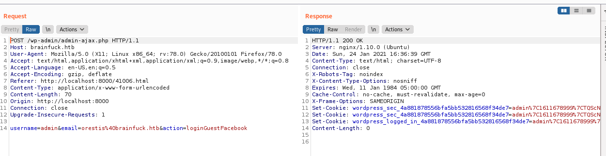

İsteği Forward yaptığımızda admin olarak sayfaya girmiş bulunuyoruz.

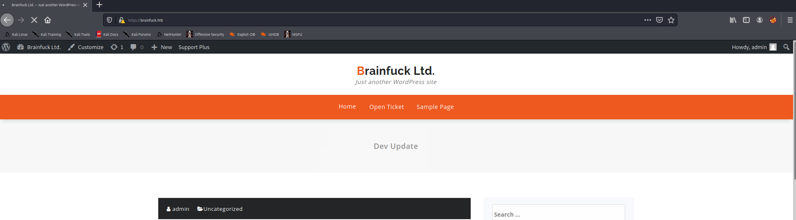

Dashboard içerisinde biraz gezindim.

EASY WP SMTP ayarlarına gidiyoruz. Password kısmını İnspect Element kısmından alalım.


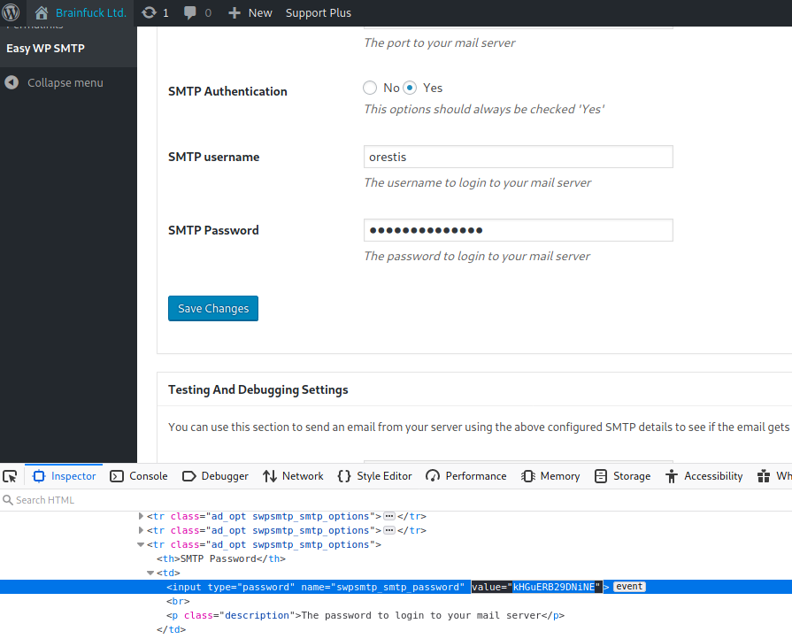

email:orestis@brainfuck.htb
SMTP username:orestis
SMTP Password:kHGuERB29DNiNE

Evolution'ı açıyorum ve bilgileri giriyorum.

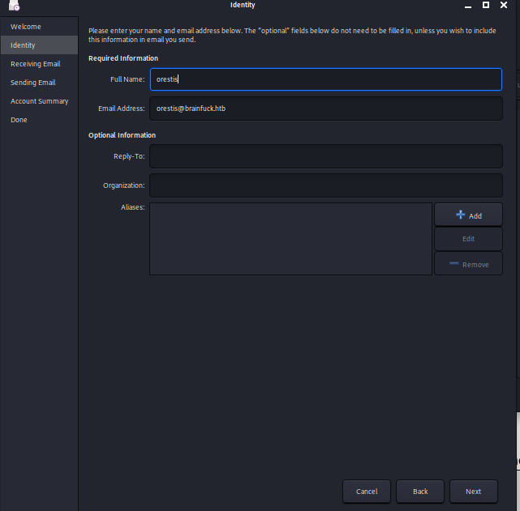

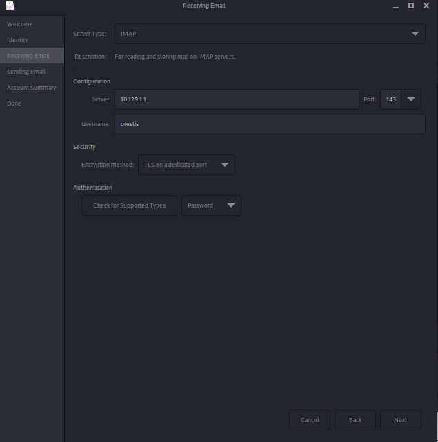

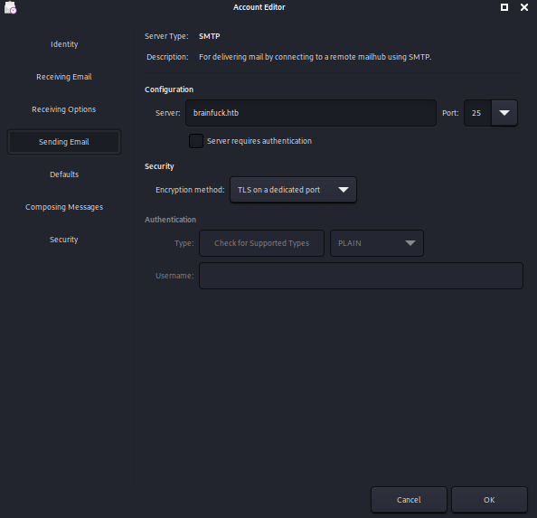

Ve inbox kısmına erişip gelen mailleri görebiliyoruz.

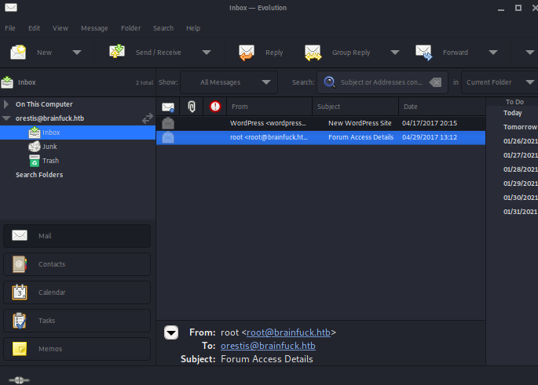

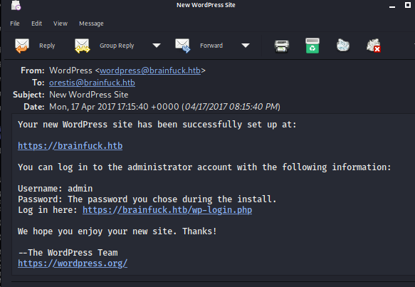

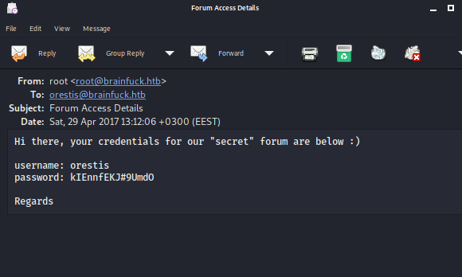


username: orestis
password: kIEnnfEKJ#9UmdO

https://sup3rs3cr3t.brainfuck.htb/ üzerinden login kısmına bu bilgilerle giriş yapmayı deniyorum. Başarılı oluyorum.

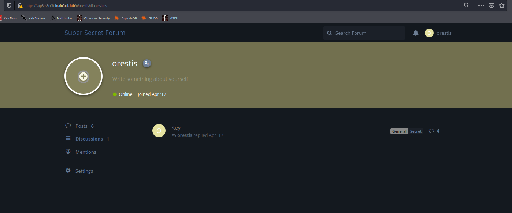


Key ve SSH sayfa kısımlarında gezindiğimde şifreli olabilecek metin ipuçlarına rastlıyorum.

```console
SSH Access

admin
SSH Access was upgraded to make use of keys. Password login is permanently disabled.

orestis
Go fuck yourself admin, I am locked out!! send me my key asap!

Orestis - Hacking for fun and profit

admin
You little shit, still no manners I see... You want me to paste it here for all members to download?

orestis
I am opening up an encrypted thread. Talk to you there!

Orestis - Hacking for fun and profit
```

```console
Key

orestis
Mya qutf de buj otv rms dy srd vkdof :)

Pieagnm - Jkoijeg nbw zwx mle grwsnn

admin
Xua zxcbje iai c leer nzgpg ii uy...

orestis
Ufgoqcbje....

Wejmvse - Fbtkqal zqb rso rnl cwihsf

admin
Ybgbq wpl gw lto udgnju fcpp, C jybc zfu zrryolqp zfuz xjs rkeqxfrl ojwceec J uovg :)

mnvze://10.10.10.17/8zb5ra10m915218697q1h658wfoq0zc8/frmfycu/sp_ptr

orestis
Si rbazmvm, Q'yq vtefc gfrkr nn ;)

Qbqquzs - Pnhekxs dpi fca fhf zdmgzt
```

Burada dikkat çeken ama gerçekten artık kafamın da yavaş yavaş gitmeye başladığı anlar. İnceleyelim pes etmek yok..

mnvze://10.10.10.17/8zb5ra10m915218697q1h658wfoq0zc8/frmfycu/sp_ptr böyle bir url var elimizde. mnvze, https olabilir. Aynı şekilde sp_ptr ise id_rsa olabilir.

Ve tüm mesajlar "Orestis - Hacking for fun and profit" ile şifrelenmiş olabilir.

Vigenera ile denediğimde sonuca ulaştım.

Polialfabetik Şifreleme(Vigenere):
Anahtara bağlı olarak her harf alfabede birden fazla harfle eşleşmektedir.

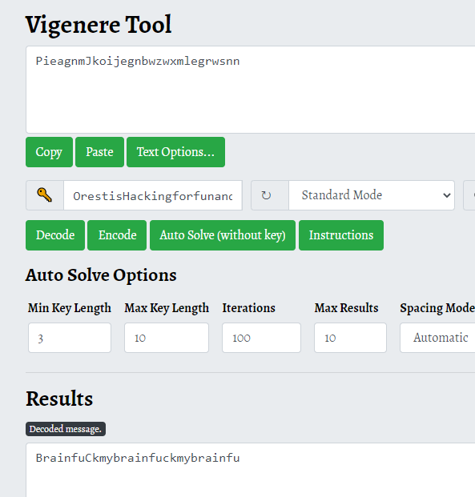

Buradaki anahtar da belli oluyor.

Input: wejmvsefbtkqalzqbrsornlcwihsf
Output: orestishackingforfunandprofit
Key: infuckmybrainfuckmybrainfuckm

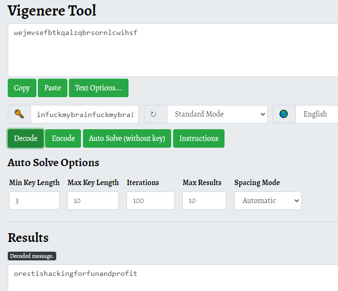

Anahtar, mesaj olduğu sürece tekrarlayan fuckmybrain'dir. 

O zaman gizemli URL'i de decode edelim.

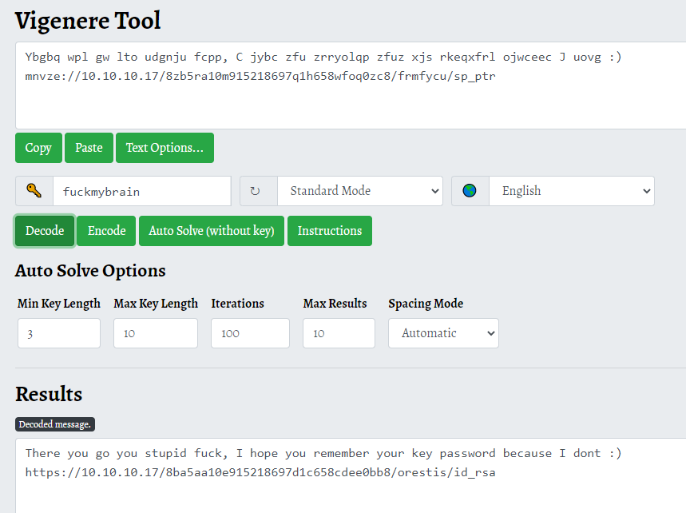

There you go you stupid fuck, I hope you remember your key password because I dont :) https://10.129.1.1/8ba5aa10e915218697d1c658cdee0bb8/orestis/id_rsa

URL'e gittiğimde id_rsa dosyasını indirdim.

Hemen ssh deneyelim ve bitsin bu çile artık.

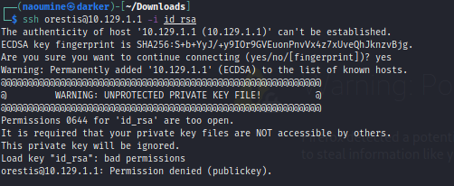

Ve bu daha fragman dedi Brainfuck. İsmini hakkıyla hakediyorsun diyerek derin nefes alarak devam edelim.

O halde id_rsa dosyasını kırmamız gerekecek.

```console
python /usr/share/john/ssh2john.py id_rsa > id_rsa.john
```
```console
john id_rsa.john --wordlist=/usr/share/wordlists/rockyou.txt
```

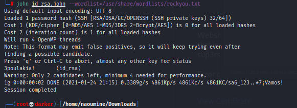

Password bulundu. 3poulakia!

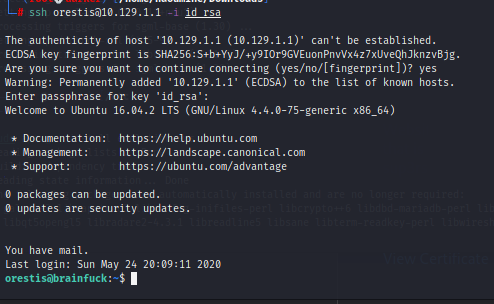

Tamamdır bu sefer oldu.

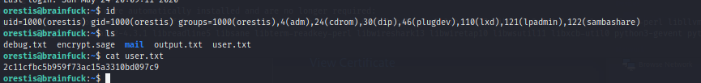

İlk bayrağımız hayırlı olsun. 

User Flag: 2c11cfbc5b959f73ac15a3310bd097c9

Sıra yetkiyi nasıl yükseltebileceğimizi düşünmekte. Dosyaları okuyalım neler varmış.

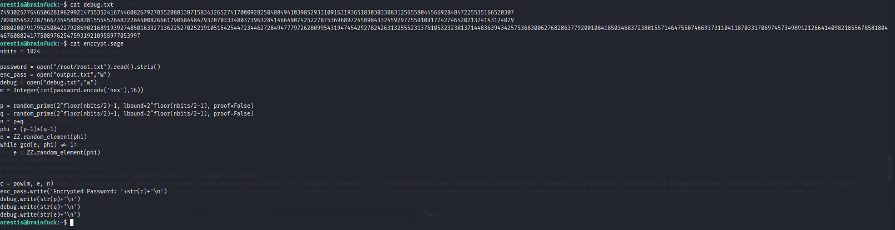

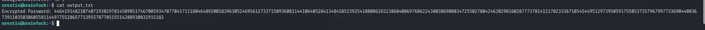

Debug.txt dosyasının RSA şifrelemesinde kullanılan p, q ve e'yi içerdiğini görebiliriz. Bu değerleri ct değerinin şifresini çözmek için kullanacak olan bu betiği çevrimiçi olarak bulabiliriz.

https://gist.github.com/intrd/3f6e8f02e16faa54729b9288a8f59582 kullanıyorum.

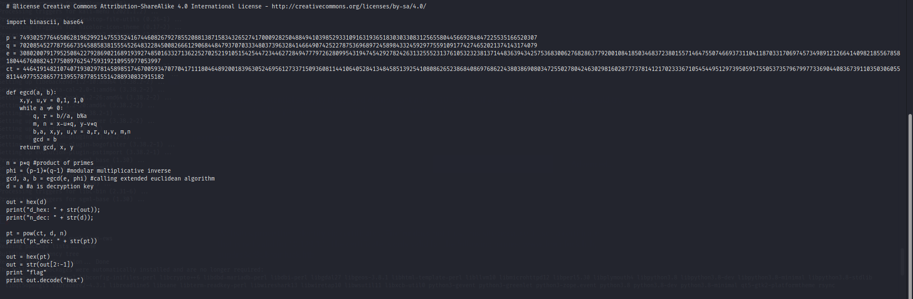

Değerleri kendi değerlerimiz ile değiştirdikten sonra çalıştırıyoruz.

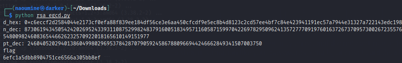

Ve geçmiş olsun cümleten.

Root Flag: 6efc1a5dbb8904751ce6566a305bb8ef