# OSCP_Preparation

Makine IP: 10.129.91.82


```console
nmap -sS -sV 10.129.91.82 
```
 
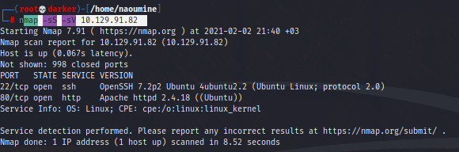

80 portundan sayfayı ziyaret etiğimde kaynak kodunda ilgi çekici bir şey yok diyor :) ama /nibbleblog/ diye bir dizin gösteriyor.

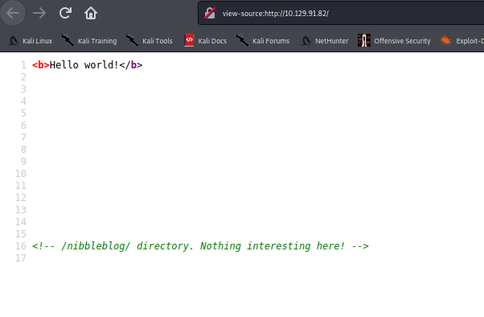

Ziyaret edelim.

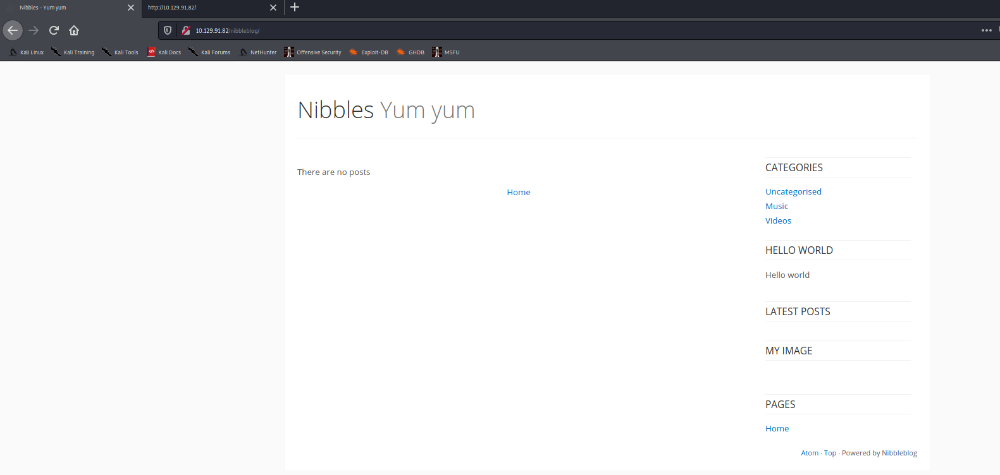

Sayfaları gezindiğimde Atom linkinde http://10.129.91.82/nibbleblog/feed.php path'inde aşağıdaki gibi bir bilgi buldum.

<feed>
<title>Nibbles</title>
<subtitle>Yum yum</subtitle>
<link href="http://10.10.10.134/nibbleblog/feed.php" rel="self"/>
<id>http://10.10.10.134/nibbleblog/feed.php</id>
<updated>2021-02-02T18:48:23+00:00</updated>
</feed>

Dizinlerde neler var bakalım.

```console
(root💀darker)-[/home/naoumine]
└─# gobuster dir -u http://10.129.91.82/nibbleblog -w /usr/share/wordlists/dirbuster/directory-list-2.3-medium.txt -x php,md,html -t 5      
```

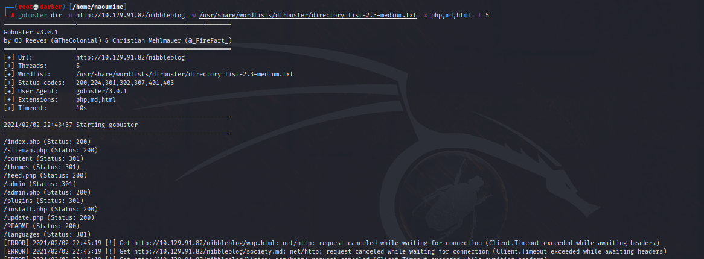

Çıkan sonuçta birkaç sayfaya göz atalım.

http://10.129.91.82/nibbleblog/README

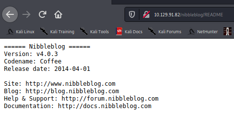

http://10.129.91.82/nibbleblog/admin.php

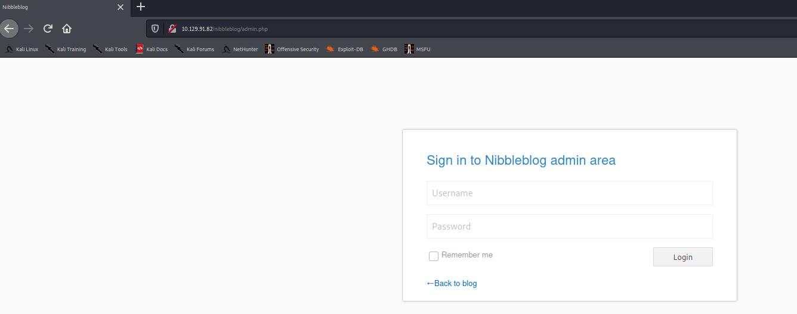

Giriş sayfasında brute force çalıştırdım ama protection olduğu için maalesef başarısız oldu.

```console
hydra -P /usr/share/wordlists/nmap.lst -l admin 10.129.91.82  http-post-form "/nibbleblog/admin.php:username=^USER^&password=^PASS^:Incorrect"
```

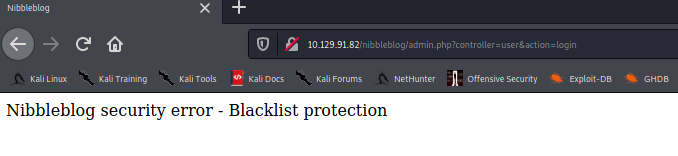


Giriş sayfasına bir kaç manuel deneme yaptıktan sonra "admin:nibbles" şeklinde giriş yaparak panele giriş yapabiliyoruz.

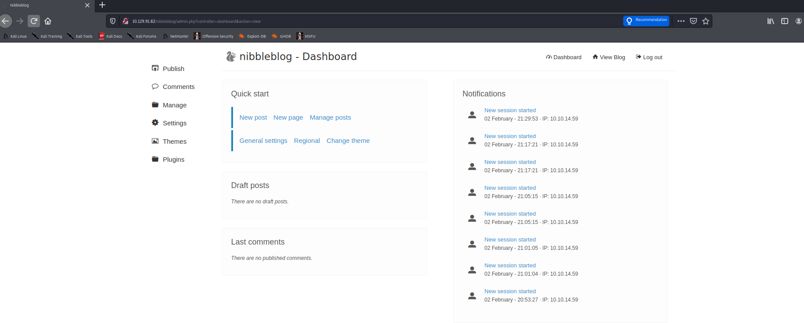


README dosyasında elde ettiğimiz versiyon ile exploit db üzerinde arama yapalım.

```console
┌──(root💀darker)-[/home/naoumine]
└─# searchsploit nibbleblog 4.0.3
```

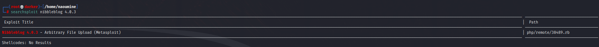

https://github.com/offensive-security/exploitdb/blob/master/exploits/php/remote/38489.rb zafiyet detaylarına buradan bakabilirsiniz.

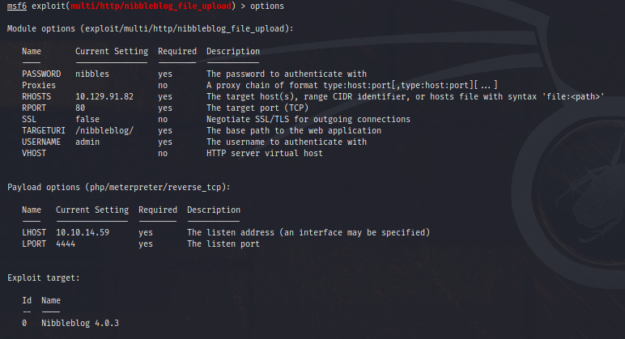

Options içerisinde gereken ayarlamaları yaptım.

Shell'e geçip interaktif olduktan sonra zip olan dosyayı açtım. Burada yetki kontrol ettiğimde monitor.sh da root yetkisi olduğunu gördüm. Bunu araç olarak kullanarak flag varsa görebiliriz.

monitor.sh dosyasını root olarak çalıştırdığımızda bayrağı elde ettim.

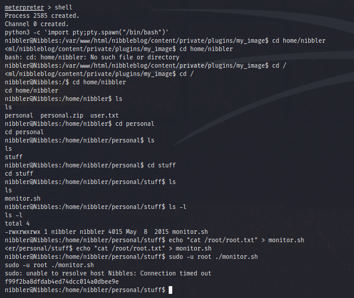

Root Flag: f99f2ba8dfdab4ed74dcc014a0dbee9e